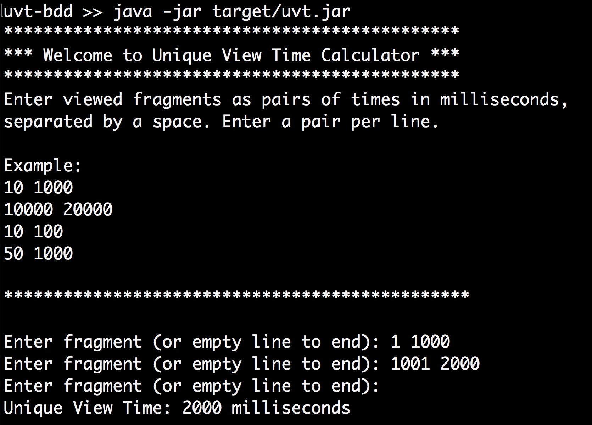

# Unique View Time with BDD Scenarios
A Java demo program that takes a collection of video viewing records and calculates UVT (unique view time), documented and tested with Cucumber, the BDD tool.




## In This Document:
1. [How to Build the Program](#how-to-build-the-program)
2. [How to Run the Program](#how-to-run-the-program)
3. [UVT Algorithm](#uvt-algorithm)
4. [How to Run the Unit Tests and Generate HTML Unit Test Report](#how-to-run-the-unit-tests-and-generate-html-unit-test-report)
5. [How to Run the Cucumber Scenarios and Generate HTML Features Report](#how-to-run-the-cucumber-scenarios-and-generate-html-features-report)
6. [Development Approach](#development-appraoch)

## How to Build the Program
You need to have [Java](https://www.oracle.com/technetwork/java/javase/downloads/jdk8-downloads-2133151.html) and [Maven](https://maven.apache.org/install.html) installed. In your terminal, clone this repository, then change directory to the newly created project directory. Using Maven, download dependencies, compile, and build executable JAR. Here are the steps:
```console
git clone https://github.com/shaundashjian/unique-view-time-bdd.git
cd unique-view-time-bdd
mvn clean package
```

## How to Run the Program
The program takes as input pairs of numbers, each pair representing the start time and end time of a viewed fragment of the video, in milliseconds. It outputs the unique view time in milliseconds. The program runs in two modes:
1. **With arguments:** With fragments entered as program arguments from the command line. For example, the following enters a pair of fragments, 0-1000, and 1000-2000:
```console
java -jar target/uvt.jar 0 1000 1000 2000
```


2. **Interactive:** Alteratively, you could run the program with no initial arguments and interactively enter a pair of times, i.e. start time and end time, for each viewed fragment. Here is how it would look like:


## UVT Algorithm
The core algorithm that calculates UVT is in the `UvtCalculator` class, `getUvt` method. 


## How to Run the Unit Tests and Generate HTML Unit Test Report
The unit tests are written with [JUnit](https://junit.org/junit4). To run the tests:
```console
mvn test
```
To generate an HTML report for the unit tests:
```console
mvn surefire-report:report
```
To view the generated report that shows unit test results, open your web browser and open the file `<project-directory>/target/site/surefire-report.html`. To do that on the `Mac`, `cd` to the project directory and then you could:
```console
open target/site/surefire-report.html
```
## How to Run the Test Scenarios and Generate HTML Test Report
The BDD scenarios are written using [Cucumber](https://cucumber.io), a [Behavior-Driven Development](https://en.wikipedia.org/wiki/Behavior-driven_development) tool. To run the scenarios and generate an HTML features report: 
```console
mvn verify
```
To view the generated report that shows overall test results and business-friendly description of the feature and scenarios, open your web browser and open the file `<project-directory>/target/site/serenity/index.html`. To do that on the `Mac`, `cd` to the project directory and then you could:
```console
open target/site/serenity/index.html
```

## Development Approach
1. I created a skeleton for the program using a Maven archetype
2. I used [Test Driven Development](https://en.wikipedia.org/wiki/Test-driven_development) with JUnit to drive out the design of the program and the algorithm. I first added one unit test for the happy path, one fragment, and created the classes and the algorithm to pass it.
3. I then added other unit tests to cover different edge cases.
4. I added BDD scenerios written in [Cucumber](https://cucumber.io). Using Cucumber scenarios improves communication with business and provides a living documentation and executable specification for the program.
5. I added the Serenity BDD plugin which generates an HTML report for the scenarios.
6. I added the Surefire Report plugin which generates an HTML report for the unit tests.

[Up](README.md)
