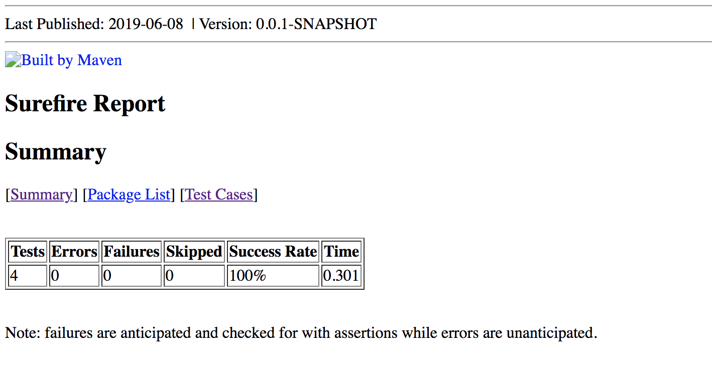
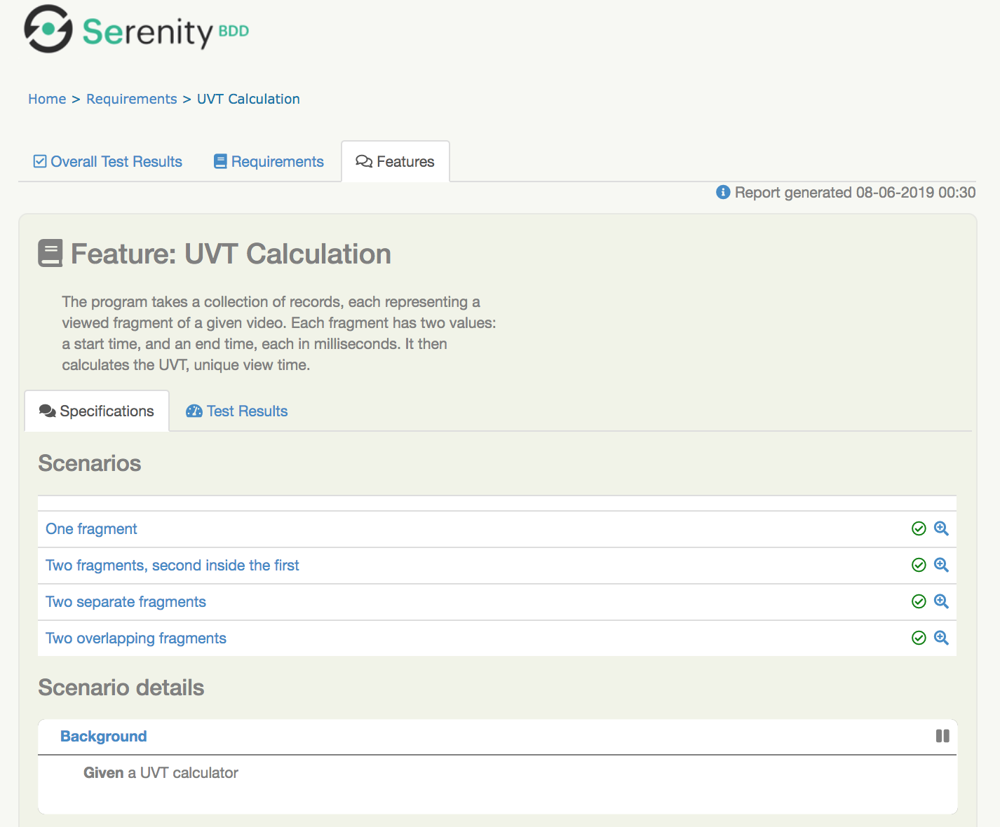
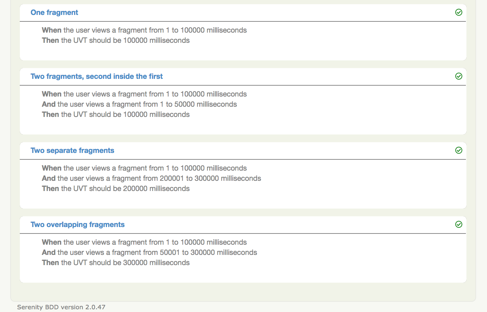

# Unique View Time Calculator with Unit Tests and Scenarios
A Java demo program that takes a collection of video viewing records and calculates the UVT, or unique view time. Unit tests in JUnit and scenarios in Cucumber are included.

```
Feature: UVT Calculation
	The program takes a collection of records, each representing a
	viewed fragment of a given video. Each fragment has two values:
	a start time, and an end time, each in milliseconds. It then 
	calculates the UVT, unique view time.
	
	Background: 
		Given a UVT calculator
		
	Scenario: One fragment
		When the user views a fragment from 1 to 10 milliseconds
		Then the UVT should be 10 milliseconds
		
	Scenario: Two fragments, second inside the first
		When the user views a fragment from 1 to 10 milliseconds
		And the user views a fragment from 1 to 5 milliseconds
		Then the UVT should be 10 milliseconds
		
	Scenario: Two fragments, first inside the second
		When the user views a fragment from 5 to 10 milliseconds
		And the user views a fragment from 1 to 20 milliseconds
		Then the UVT should be 20 milliseconds
		
	Scenario: Two separate fragments
		When the user views a fragment from 1 to 10 milliseconds
		And the user views a fragment from 21 to 30 milliseconds
		Then the UVT should be 20 milliseconds
		
	Scenario: Two overlapping fragments from the right
		When the user views a fragment from 1 to 10 milliseconds
		And the user views a fragment from 5 to 15 milliseconds
		Then the UVT should be 15 milliseconds
		
	Scenario: Two overlapping fragments from the left
		When the user views a fragment from 10 to 20 milliseconds
		And the user views a fragment from 5 to 15 milliseconds
		Then the UVT should be 16 milliseconds
		
	Scenario: Three Fragments Second Separate From First
		When the user views a fragment from 6 to 10 milliseconds
		And the user views a fragment from 11 to 15 milliseconds
		And the user views a fragment from 9 to 13 milliseconds
		Then the UVT should be 10 milliseconds
		
	Scenario: Three Fragments Second Right After The First
		When the user views a fragment from 6 to 10 milliseconds
		And the user views a fragment from 16 to 20 milliseconds
		And the user views a fragment from 9 to 17 milliseconds
		Then the UVT should be 15 milliseconds
 ```


## In This Document:
1. [Live Demo URL](#live-demo-url)
2. [How to Build the Program](#how-to-build-the-program)
3. [How to Run the Program](#how-to-run-the-program)
4. [The UVT Algorithm](#the-uvt-algorithm)
5. [How to Run the Unit Tests and Generate the HTML Unit Test Report](#how-to-run-the-unit-tests-and-generate-the-html-unit-test-report)
6. [How to Run the Cucumber Scenarios and Generate the HTML Features Report](#how-to-run-the-cucumber-scenarios-and-generate-the-html-features-report)
7. [Development Approach](#development-approach)

## Live Demo URL
http://shaundashjian.com:8080/UniqueViewTimeCalculator/

**Note:** This is the URL for the live demo of [the JavaScript implementation of the UVT algorithm, with GUI built with AngularJS.](https://github.com/shaundashjian/uvt-gui).

## How to Build the Program
You need to have [Java](https://www.oracle.com/technetwork/java/javase/downloads/jdk8-downloads-2133151.html) and [Maven](https://maven.apache.org/install.html) installed to build and run the program. In your terminal, clone this repository, then change directory to the newly created project directory. Using Maven, download dependencies, compile, and build the executable JAR. Here are the steps:
```console
git clone https://github.com/shaundashjian/unique-view-time-bdd.git
cd unique-view-time-bdd
mvn package
```

## How to Run the Program
The program takes as input pairs of numbers, each pair representing the start time and end time of a viewed fragment of the video, in milliseconds. It outputs the unique view time in milliseconds. The program runs in two modes:
1. **With arguments:** You enter the fragments as program arguments from the command line. For example, the following enters a pair of fragments, 0-1000, and 1000-2000:
```console
java -jar target/uvt.jar 0 1000 1000 2000
```


2. **Interactive:** Alteratively, you could run the program with no initial arguments. Run the program and interactively enter a pair of times, i.e. start time and end time, for each viewed fragment. Here is how it would look like:


## The UVT Algorithm
The core algorithm that calculates UVT is in the [`UvtCalculator` class](src/main/java/com/shaundashjian/uvt/UvtCalculator.java)
```
public int getUvt() {
		// Sort the fragments
		Collections.sort(fragments);
		// Create list of ranges
		List<Fragment> mergedRanges = new ArrayList<>();
		// Loop through fragments
		START_OVER:
		for (int i = 0; i < fragments.size(); i++) {
			Fragment fragment = fragments.get(i);
			boolean covered = false;
			// If fragment is already fully covered, do nothing
			for (Fragment range : mergedRanges) {
				if (fragment.getStartTime() >= range.getStartTime() && fragment.getStartTime() <= range.getEndTime()
						&& fragment.getEndTime() >= range.getStartTime()
						&& fragment.getEndTime() <= range.getEndTime()) {
					covered = true;
					break;
				}
			}
			// If fragment is not already fully covered
			if (!covered) {
				// Check if the fragment partially overlaps an existing range
				
				for (Fragment range : mergedRanges) {
					if (fragment.getStartTime() >= range.getStartTime() && fragment.getStartTime() <= range.getEndTime()
							&& fragment.getEndTime() > range.getEndTime()) {
						fragment.setStartTime(range.getEndTime() + 1);
						i--;
						continue START_OVER;
					}
					if (fragment.getStartTime() < range.getStartTime() 
							&& fragment.getEndTime() >= range.getStartTime()
							&& fragment.getEndTime() <= range.getEndTime()) {
						fragment.setEndTime(range.getStartTime() - 1);
					}
				}

				mergedRanges.add(fragment);

			}
		}
		// Calculate uvt using all merged ranges
		int uvt = 0;
		for (Fragment fragment : mergedRanges) {
			uvt += fragment.getEndTime() - fragment.getStartTime() + 1;
		}
		return uvt;
	}
  ```

## How to Run the Unit Tests and Generate the HTML Unit Test Report
The unit tests are written with [JUnit](https://junit.org/junit4). To run the tests:
```console
mvn test
```
To generate an HTML report for the unit tests:
```console
mvn surefire-report:report
```
To view the generated report that shows unit test results, open your web browser and open the file `<project-directory>/target/site/surefire-report.html`. To do that on the `Mac`, `cd` to the project directory and then you could:
```console
open target/site/surefire-report.html
```



## How to Run the Cucumber Scenarios and Generate the HTML Features Report
The BDD scenarios are written using [Cucumber](https://cucumber.io), a [Behavior-Driven Development](https://en.wikipedia.org/wiki/Behavior-driven_development) tool. To run the scenarios and generate an HTML features report: 
```console
mvn verify
```
To view the generated report that shows overall test results and business-friendly description of the feature and scenarios, open your web browser and open the file `<project-directory>/target/site/serenity/index.html`. To do that on the `Mac`, `cd` to the project directory and then you could:
```console
open target/site/serenity/index.html
```




## Development Approach
1. I created a skeleton for the program using a Maven archetype.
2. I used [Test Driven Development](https://en.wikipedia.org/wiki/Test-driven_development) with JUnit to drive out the design of the program and the algorithm. I first added one unit test for the happy path, one fragment from 0 to 100000, and created the classes and the algorithm to pass it.
3. I then added other unit tests to cover different edge cases.
4. I added scenerios written in [Cucumber](https://cucumber.io). Using Cucumber scenarios improves communication with business and provides a living documentation and executable specification for the program.
5. I added the [Serenity BDD](https://www.thucydides.info/#/) plugin which generates an HTML report for the scenarios.
6. I added the [Surefire Report](https://maven.apache.org/surefire/maven-surefire-report-plugin/) plugin which generates an HTML report for the unit tests.

[Up](README.md)
