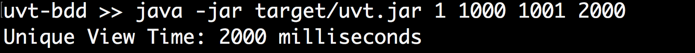

# unique-view-time
A Java demo program that takes a collection of video viewing records and calculates UVT (unique view time)


## In This Document:
1. [How to Build the Program](#how-to-build-the-program)
2. [How to Run the Program](#how-to-run-the-program)
3. [UVT Algorithm](#uvt-algorithm)
4. [How to Run the Unit Tests](#how-to-run-the-unit-tests)
5. [Development Approach](#development-appraoch)

## How to Build the Program
You need to have [Maven](https://maven.apache.org/install.html) installed. In your terminal, clone this repository, then `cd` to the newly created project directory. Using Maven, download dependencies, compile, and build executable JAR:
```console
git clone https://github.com/shaundashjian/unique-view-time.git
cd unique-view-time
mvn clean package
```

## How to Run the Program
The program takes as input pairs of numbers, each pair representing the start time and end time of a viewed fragment of the video, in milliseconds. It outputs the unique view time in milliseconds. The program runs in two modes:
1. **With arguments:** With fragments entered as program arguments from the command line. For example, the following enters a pair of fragments, 0-1000, and 1000-2000:
```console
java -jar target/uvt.jar 0 1000 1000 2000
```


2. **Interactive:** Alteratively, you could run the program with no initial arguments and interactively enter a pair of times, i.e. start time and end time, for each viewed fragment. Here is how it would look like:


## UVT Algorithm
The core algorithm that calculates UVT is in the `UvtCalculator` class, `getUvt` method. 


## How to Run the Unit Tests
```console
mvn test
```
## Development Approach
1. I created a skeleton for the program using a Maven archetype
2. I used [Test Driven Development](https://en.wikipedia.org/wiki/Test-driven_development), adding a unit test for the happy path and writing the algorithm to pass the test.
3. I then added other unit tests to cover edge cases.

[Up](README.md)
